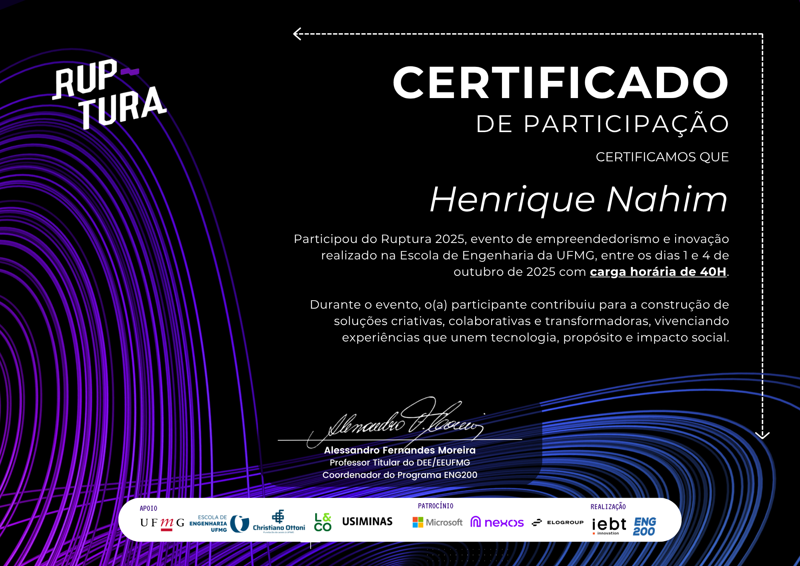

# Bem-vindo!

## Olá Mundo, sou Henrique Nahim! 

:computer: Sou estudante de Ciência da Computação!

:house_with_garden: Sou do Brasil.

:books: Atualmente aprendendo tudo o que for possível.

:outbox_tray: Metas para 2025: encontrar um novo estágio, progredir na Universidade e aprender saxofone.

:ladder: Dê-me uma função e eu serei funcional.

## Sobre mim 

 

- Sou estudante de ciência da computação. Gosto de escrever poemas e textos reflexivos sobre a minha vida e as coisas que acontecem comigo. Sou uma pessoa muito reflexiva e gosto de estar na presença de pessoas.

- Dê-me uma função e eu serei funcional.

- Obrigado pela visita.

- Aproveite!! o/

---

### 🤝 Cooperação Técnica & Inclusão Social

**Projeto Experimental em Neurodiversidade (TEA)**

**Parceria:** Consultório de Psicologia Dr. Amarílio Campos | Belo Horizonte  
**Período:** 2022 – Presente (Atuação Quinzenal)

Atuo como monitor técnico liderando grupos neste projeto supervisionado pelo Psicólogo Dr. Amarílio Campos. O objetivo é utilizar a lógica de programação como ferramenta terapêutica para o desenvolvimento cognitivo e social de jovens com Transtorno do Espectro Autista (TEA).

**O que fazemos:**
* **Gestão de Grupos:** Condução de atividades coletivas e *Pair Programming*, mediando a interação social e o trabalho em equipe entre os participantes para combater o isolamento.
* **Java & Python:** Desenvolvimento de projetos lúdicos para engajamento e foco.
* **C / C++:** Exercícios de sintaxe rígida para estimular atenção aos detalhes e tolerância à frustração.

**Impacto:** Auxilio na tradução da complexidade técnica para uma linguagem acessível, criando uma ponte entre a Exatidão (Computação) e o Comportamento (Psicologia).

### Meus projetos mais valiosos

* [Hackathon Ruptura 2025](https://github.com/hsnahim/ruptura2025) - Durante este hackathon, desenvolvemos uma plataforma *low-code* para treinamento de modelos de IA, utilizando algoritmos de árvore de decisão e Naive Bayes.

* [Workshop RAG IA](https://github.com/webtech-network/lab-assistentes) - Um workshop focado no uso de RAG (Geração Aumentada de Recuperação) com documentos para criar agentes de IA.

* [Workshop de automação web usando Puppeteer](https://github.com/webtech-network/lab-puppeteer) - Foi um workshop sobre automação web utilizando a biblioteca Node.js, Puppeteer.

### Badges e certificados

### Linguagens e frameworks que conheço 
       
          

