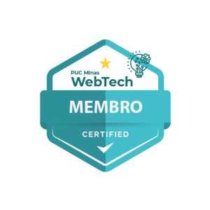

# Welcome!

## Hello Word, I'm Henrique Nahim! 

:computer: I'm student of Computer Science!

:house_with_garden: I’m from Brazil.

:books: I’m currently learning everything was possible.

:outbox_tray: 2025 Goals: find a new internship, go up on University and learn saxophone.

:ladder: Give me a function and i will be functional

## About me 

 

- I am a computer science student. I enjoy writing poems and reflective texts about my life and the things that happen to me. I am a very reflective person and I like to be in the presence of people.

- Give me a function and i will be functional

- Thanks for visiting.

- Enjoy it!! o/

### My most valuable projects

* [Hackathon Ruptura 2025](https://github.com/hsnahim/ruptura2025) - During this hackathon, we developed a low-code platform for AI model training, utilizing decision tree and Naive Bayes algorithms.

* [Workshop RAG IA](https://github.com/webtech-network/lab-assistentes) - A workshop focused on using RAG with documents to create AI agents

* [Workshop web automation using pupeteer](https://github.com/webtech-network/lab-puppeteer) - It was a workshop about web automation using the Node.js library, Puppeteer

### Badge and certificates

### Languages and frameworks ​​I know 
<!-- Link com os badges para inserir https://devicon.dev/ -->

       
          

